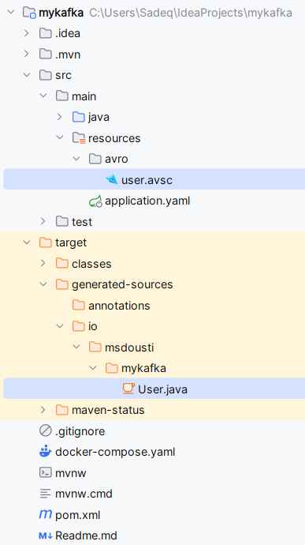
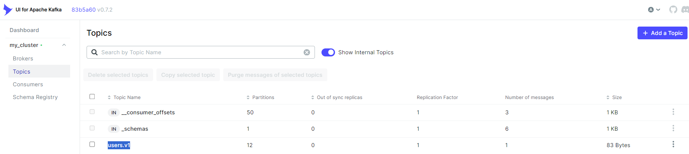
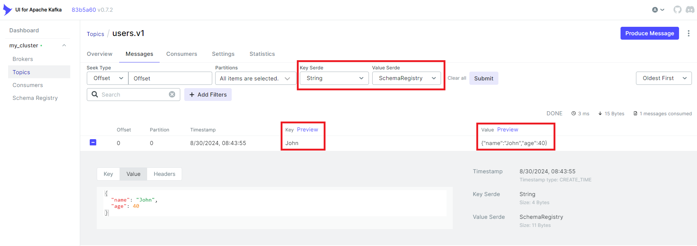
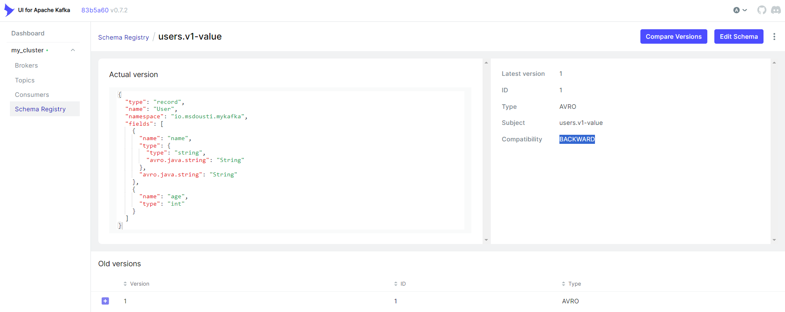

# Getting Started

1. Run Docker Compose to set up Kafka, Schema Registry, and Kafka-UI:
    ```shell
    docker-compose up -d
    ```
2. Run project
    ```shell
    ./mvnw spring-boot:run
    ```
   It will generate the `User` class from the given `user.avsc` Avro schema (the file is located
   in `/src/main/resources/avro` directory):

  

   You should see this in the output log:
   ```text
   2024-08-30T08:43:55.421+02:00  INFO 16580 --- [           main] io.msdousti.mykafka.Producer             : Produced user -> {"name": "John", "age": 40}
   ```

Now, if you navigate to Kafka-UI web interface (http://localhost:9000/), you will see the `users.v1` topic in
the `Topics` section:


Click on the topic, and go to the `Messages` tab. Make sure the proper Serde is picked for both Key and Value. You
should see the message we just produced:


Now, in the Schema Registry section, you should see `users.v1-value`. Click on it to see further info.
Note that version is 1,
and [compatibility mode](https://docs.confluent.io/platform/current/schema-registry/fundamentals/schema-evolution.html)
is set to Backward.


Play with changing the schema! If the changes are backwards **incompatible**, messages won't be accepted:

```
2024-08-30T09:06:09.453+02:00 ERROR 8792 --- [           main] o.s.k.support.LoggingProducerListener    : Exception thrown when sending a message with key='John' and payload='{"name": "John", "age": 40, "age1": 40}' to topic users.v1:

org.apache.kafka.common.errors.InvalidConfigurationException: 
Schema being registered is incompatible with an earlier schema for subject "users.v1-value", details: 
[{errorType:'READER_FIELD_MISSING_DEFAULT_VALUE', description:'The field 'age1' at path '/fields/2' in the new 
schema has no default value and is missing in the old schema', additionalInfo:'age1'}, {oldSchemaVersion: 1}, 
{oldSchema: '{"type":"record","name":"User","namespace":"io.msdousti.mykafka",
"fields":[{"name":"name","type":{"type":"string","avro.java.string":"String"},"avro.java.string":"String"},{"name":"age","type":"int"}]}'}, 
{validateFields: 'false', compatibility: 'BACKWARD'}]; 
error code: 409
```
